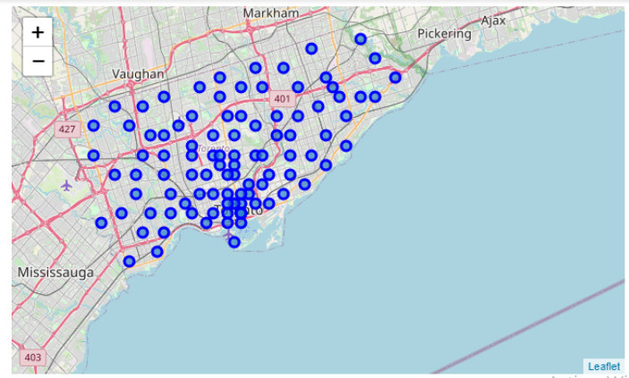
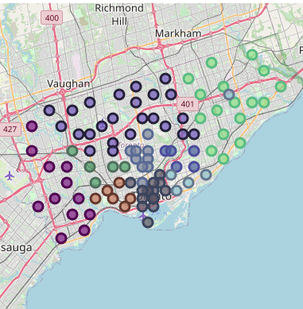
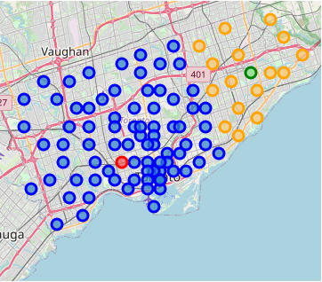

# 2. Data acquisition and cleaning

## 2.1 Data Sources
Different data sources compose the final dataset. Starting from Wikipedia’s article: List of postal codes of Canada: M, getting the data via parsing the HTML code, and where the features name of neighborhood, postal code, borough were extracted.
	From there, using the geolocator in the package pygeo, and the postal code of each neighborhood, we could obtain the latitude and longitude belonging to each respective neighborhood. Also were deleted the wrong values with NaN type assigned. The neighborhood distributions following the geolocation looks like the next image:

Figure 2.1: Neighbourhoods distribution in Toronto City

		
Applying the jaccard distance provided by geopy, and passing as parameters the longitude and latitude of the neighbourhoods, we got the distance between the job neighborhood and each single neighborhood in kilometers. In example, the neighborhood Parkwoods, located in North York, is 7.58 kilometers from Cedarbrae.
	Already with the neighbourhood's location, the next step was to get the first 100 venues in a radius of 500 meters with respect to each neighborhood. This was achieved with the Foursquare API which provides a different useful information in relation with venues. From these data we extracted the following features: venue category, venue name, venue address, venue id (API id), category id (API id), venue latitude and venue longitude.

## 2.2 Data cleaning

All the data was merged into a single dataset. The data extracted from Wikipedia HTML table had a lot of insignificant places with values “not assigned”, so all of these values were removed. 
	Then, when extracting the location of the neighborhoods, some of the postal code query returns NaN values, so they also were removed after analysing the impact of these in the data.
	Finally, visualizing the neighborhoods segmenting by borough, we could see the wrong value corresponding to Business reply mail Processing Centre, South Central Letter Processing Plant Toronto. As we can see in the map (look at figure 2.2), between the light green neighborhoods (Scarborough borough) there is a cercle with other colors.

Figure 2.2: Wrong neighborhood assignation

Business reply mail Processing Centre, South Central Letter Processing Plant is not even a neighborhood, but a mailing service, so also was removed from the dataset.

Figure 2.3: Feature selection

				

The following features were removed: venue id, category id, venue latitude, venue longitude and venue address. This is because these features are useful to extract more and more data (for example the venue id is useful to extract more data from Foursquare API) which is out of this scope.
	Then, using the One Hot Encoder technique we got the boolean values of the category type by neighbourhood. This allows us to do Exploratory Data Analysis on the frequency of venues categories in the neighbourhood.
	We also kept the distance between the job neighbourhood and each neighborhood with the motivation of discard options that are further away than Dufferin, the current neighborhood.

